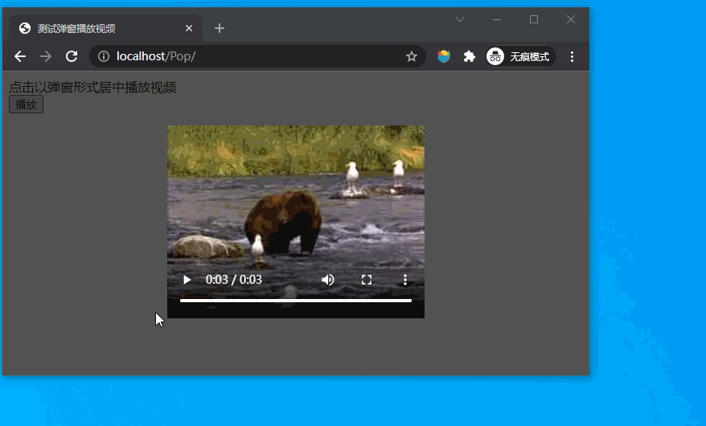
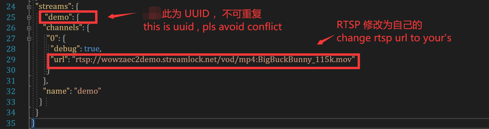

> 这是一个弹窗居中播放 RTSP 视频的测试项目

# 功能：

1. 弹窗并播放 RTSP 视频 （基于 webrtc 推流）

2. 弹窗动态适应浏览器窗口保持居中

3. 蒙版渐隐渐显

4. 非网页前端，大佬轻拍

# 演示：

# 如何使用：

1. 开启 ``WebServer`` ，路径是 **WebServer/MyWebServer.exe**
   
   请留意，默认的端口是 ：80 ，如遇端口冲突请通过此服务器设置页指定其他端口。

2. 开启 ``RTSPtoWebServer`` , 路径是 **RTSPtoWebServer/RTSPtoWeb.exe**
   
   此服务器默认端口是 ：8083，如遇端口冲突，修改 config.json 中``"http_port": ":8083"`` 的值即可。

3. 现在可以测试 RTSP 视频播放了：
   
   * 浏览器输入：``http://localhost/player/`` 即可测试笔者整理的中间弹窗播放 RTSP 视频的功能
   
   * 浏览器输入：``http://127.0.0.1:8083`` 可以开启 [RTSPtoWeb](https://github.com/deepch/RTSPtoWeb) 提供的测试页面。

4. 如何使用自己的 rtsp 链接呢？
   
   > 前提： 只支持 H264 编码的视频
   
   a. 打开 **RTSPtoWebServer/config.json** 
   
   b. 按照原来的格式添加自己的 rtsp 数据，id 不可重复。))
   
   
   
   c. 打开 **RTSPPlayer/index.html** 修改 ShowPanel 方法中 player.load("demo");  的 ``demo`` 字眼为你写的id

 

# 写到最后：

* 如果希望弹窗的动效更丰富，可以使用类似 [layer.js](http://www.h-ui.net/lib/layer.js.shtml) 弹窗类的插件

* 这个仓库使用了 [jquery](https://github.com/jquery/jquery)

* ~~后面想做一个通过[RTSPtoWebRTC](https://github.com/deepch/RTSPtoWebRTC) 把 rtsp 直播流整到Unity webgl 的示例，所以先撸个弹窗试下~~

* 实现了弹窗播放 RTSP 视频的功能

# Reference：

* [vdalex25/WebRtcPlayer: example player for RTSPtoWebRTC project ](https://github.com/vdalex25/WebRtcPlayer)

* [deepch/RTSPtoWeb: RTSP Stream to WebBrowser](https://github.com/deepch/RTSPtoWeb)

> License MIT 
